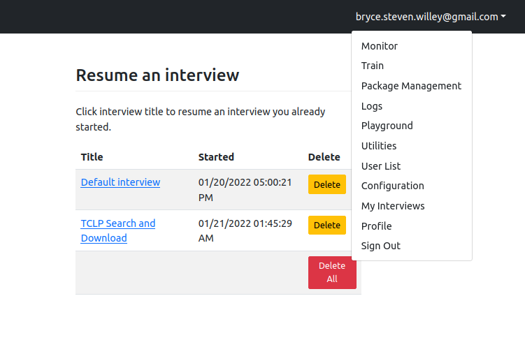
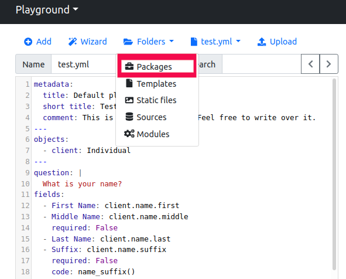
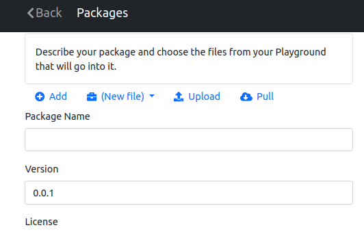
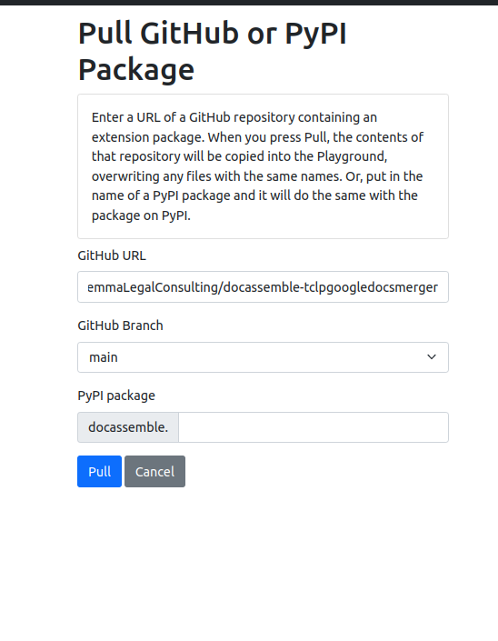
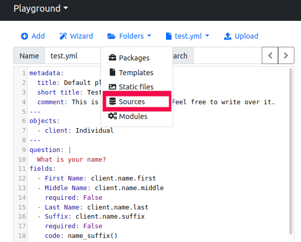

# docassemble.tclpgoogledocsmerger

A docassemble extension that helps a user search for docs in a Google Drive based on tags / metadata.

Made in association with The [Chancery Lane Project](https://chancerylaneproject.org/)

Special dependencies:
* an [updated docxcompose](https://github.com/BryceStevenWilley/docxcompose), version `1.3.5-devlemma`.
* a branch of docassemble that supports optgroups](https://github.com/BryceStevenWilley/docassemble/tree/optgroups)

## Refreshing the Airtable Data Source.

This interview uses the data in [an Airtable](https://airtable.com/shr5ITqr8fOECQthj/tblZduZJJkNz9tbzY), exported to a CSV file, to
determine which clause applies to a particular query.

There are two parts to updating this data source: setting up a way to modify the installed interview on a server, and
actually updating the CSV file. The first step only needs to be done once, per user per server.

### Modifying an installed interview

1. Login to your server. You should have at least developer privileges.
2. Go to the playground (click your email on the top right of the screen to reveal a drop down, then click on "Playground").
  
3. Once in the playground, you need to pull the latest version of the code from Github. Click "Folders > packages", then "Pull".
  

  

4. There, enter the information of this github repo:
  * github url: https://github.com/LemmaLegalConsulting/docassemble-tclpgoogledocsmerger
  * branch: main
  Press pull.
  
5. Press back (top left of the screen) until you are at the playground screen again.

### Updating the CSV file.

1. Go to the [Airtable with the clause data](https://airtable.com/shr5ITqr8fOECQthj/tblZduZJJkNz9tbzY).
2. Press "download as CSV", hidden behind the three dots. Save the CSV file on your computer as `Grid_view.csv`.
  
3. Go back to your playground on the docassemble server.
4. In the playground, go to "Folders > Sources".
  
5. On the sources page, upload the `Grid_view.csv` file by pressing "Browse..." and then "Upload".
  
6. Press back (top left) to go back to the playground. Then go to "Folders > packages".
  
7. (optional) on this screen, you can update the version. This allows you to easily know what version of the Airtable document
  is being used in production. Change the version to anything you like. The default looks like 1.2.3, but you can add text as well, i.e.
  1.2.3-march-data. Change this version number and press save at the bottom of the screen.
8. Press "Install" at the bottom of the screen. This will cause the server to restart, so avoid updating during peak traffic times.

## Authors

Bryce Willey, Quinten Steenhuis

